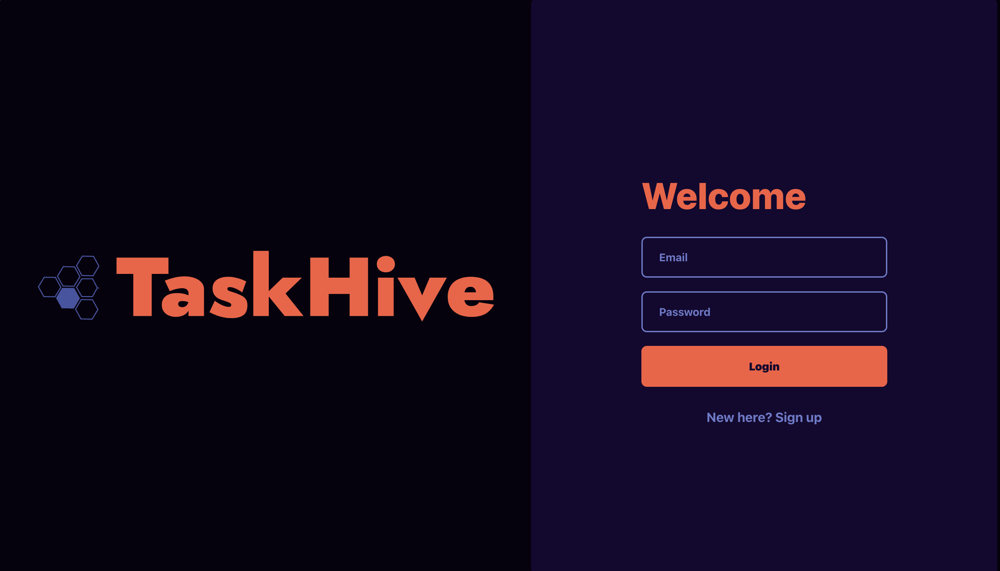

# TaskHive - Project Management

## Description
Task Hive is a project management application that allows users to create projects and tasks to help track their work. The application allows users to perform various operations such as adding, updating, and removing projects and tasks. Working on Task Hive allowed us to gain valuable experience with react and setting up a mongo database. Utilizing graphQL allowed us to create a more efficient application by only querying the data we needed. Using a new technology like dnd-kit allowed us to create a more user friendly application by allowing users to drag and drop items.

## Table of Contents

- [Installation](#installation)
- [Usage](#usage)
- [Credits](#credits)
- [License](#license)
- [Contributors](#contributors)
- [Contributing](#contributing)
- [Tests](#tests)
- [Questions](#questions)

## Installation

No installation is required to use this project simply navigate to the web aplication and get started!

[Task Hive](https://taskhive-3576fd3630ff.herokuapp.com/)

## Usage

To use the Task Hive application, follow these simple steps:

1. Navigate to the deployed [Task Hive](https://taskhive-3576fd3630ff.herokuapp.com/)
2. Sign in with existing log in creditials or create a new one!
3. Start adding projects/tasks and tracking your work!

## Credits

- [apollo-server-express](https://www.npmjs.com/package/apollo-server-express)
- [Express.js](https://expressjs.com/)
- [brcypt](https://www.npmjs.com/package/bcrypt)
- [MongoDB](https://www.mongodb.com/)
- [graphQL](https://graphql.org/learn/)
- [dnd-kit](https://www.npmjs.com/package/@dnd-kit/core)
- [react](https://reactjs.org/)
- [jwt](https://jwt.io/)

## License

The Task Hive application is licensed under the MIT License. See the [LICENSE](LICENSE) file for more details.

## Contributors

- [Cheryl Loedffler](https://github.com/Cheloe)
- [Joshua Bott](https://github.com/josh4got)
- [Philip Dangerfield](https://github.com/pdangerfield)
- [Shruthi Rajashekar](https://github.com/shruthisalimath)

## Contributing

If you would like to contribe to this project contact me through the email found in the questions section.

## Tests

N/A

## Questions

If you have any questions, please contact me at [philipdangerfield1@gmail.com](mailto:philipdangerfield1@gmail.com).